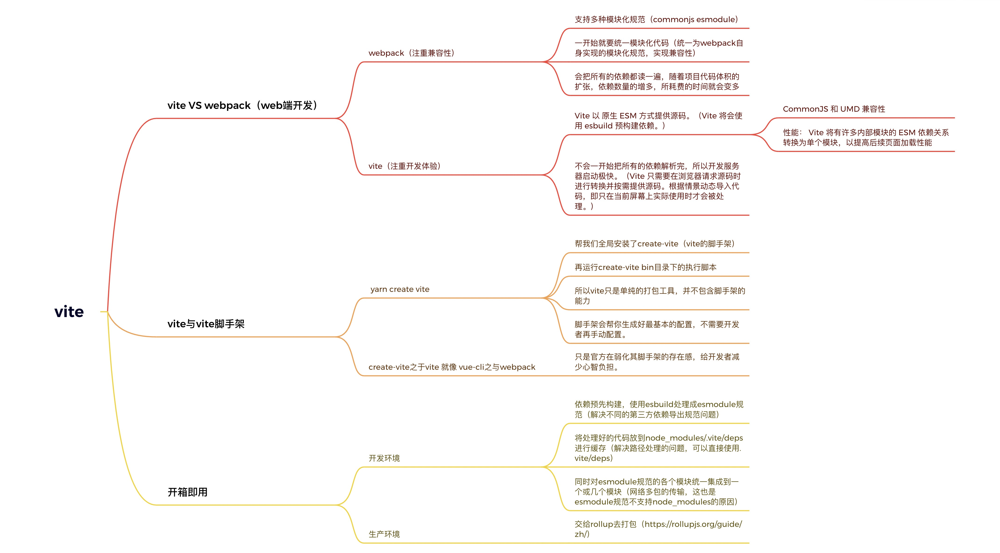

# 什么是构建工具
1. typescript
2. React/vue
3. less/sass/stylus
4. 语法降级
5. 体积优化：代码压缩
6. ·····

1. 模块化开发支持： 
2. 集成各种编译工具，
3. 提高项目性能
4. 优化开发体验： 
+ 自动监听文件变化，热更新
+ 开发服务器
不用每次都关心代码如何在浏览器中如何运行，只需要首次提供一个配置文件（也可以不需要，会有默认值）。它让我们不用关心生产的代码也不用关心代码如何在浏览器运行，只需要关心业务代码。

# vite相较于webpack的优势
起因： 项目越大-->处理的js代码越多
结果： 构建工具需要很长的时间（启动开发服务器 ---> 把项目跑起来）

```bash
yarn start

yarn dev

npm run dev

npm run start
```
**commonjs esmodule 规范**
webpack 支持多种模块化代码，一开始必须要统一模块化代码，所以要把所有的依赖读一遍，如果依赖很多就会耗费很长的时间。
（关注兼容性）

vite只支持esmodule规范的模块，不会一开始把所有的依赖解析完，所以开发服务器启动极快。
（关注浏览器开发体验）

# vite与vite脚手架的区别

```bash
yarn create vite

```
1. 帮我们全局安装了： create-vite(vite的脚手架，官方并没有说明)
2. 直接运行create-vite bin目录下的一个执行配置

vue-cli  ---> webpack
等同于
create-vite ---> vite (创建一套模板，把配置调整到最佳实践)

# 开箱即用

+  遇到相对路径会尝试开启路径补全
+ 生产和开发
开发 yarn dev 缓存---->   有的第三方依赖是commonjs规范导出， 依赖预先构建，用esbuild 处理成esmodule规范，放到node_modules/.vite/deps 同时对esmodule规范的各个模块统一集成。
解决了三个问题:
```
1. 不同的第三方依赖导出格式不同
2. 对路径处理可以直接使用.vite/deps
3. 网络多包传输的性能问题（esmodule规范不支持node_modules的原因）

预构建尽可能集成生成一个模块或几个模块
```
生产： 交给rollup去打包

# 配置处理细节

1. 环境处理

# 环境变量
> 会根据当前代码环境产生值的变化的变量

1. 开发环境
2. 测试环境
3. 预发布环境
4. 灰度环境
5. 生产环境

百度地图sdk， APP_KEY 不同环境是不一样的key

vite ---> dotenv自动读取.env文件，并解析文件中的环境变量，考虑到其他配置的冲突问题，不会直接注入到process中。
可以手动调用loadEnv方法，明确指定env文件

process.cwd : 返回当前node进程的工作目录

.env 所有环境
.env.development 开发环境  vite默认
.env.production 生产环境 vite默认

loadEnv

# vite是怎么让浏览器识别.vue文件的


# 在vite中处理css

vite天生就支持对cSS文件的直接处理

1. vite在读取到main.js中引用到了Index.css
1.  直接去使用fs模块去读取index.css中文件内容
2.  直接创建一个style标签，将index•css中文件内容直接copy进style标签里
3.  将style标签插入到index.html的head中
4.  将该css文件中的内容直接替换为js脚本（方便热更新或者css模块化），同时设置Content-Type为js 从而让浏览器以JS脚本的形式来执行该css后缀的文件

less  sass ---> 预处理器
postcss ---> 后处理器


# vite加载静态资源
开箱即用

性能差（tree shaking优化）： 打包工具自动移除没有用到的变量或方法
优化：
1. 控制导入（按需引入）

### vite 处理图片
```js
// 获取到绝对路径
import img from "./ccc.png?url"

// 获取到buffer字符串，
import img from "./ccc.png?raw"
```
3. resolve.alias 原理
字符串替换（将别名进行特殊处理，处理成绝对路径）

### vite 处理svg
img.src = svg
或者直接导入源文件


### 打包之后静态资源会有hash
浏览器的缓存机制，静态资源名字不改浏览器会直接用缓存的

content hash
内容不变 hash字符串不会变
可以更好的利用浏览器缓存机制


# vite插件
生命周期的不通阶段去调用不用的插件已达到不同的目的

### vite-aliases
可以自动生成别名， 检当前目录下的所有文件夹，并生成别名

### vite-plugin-html
动态控制html的内容

### vite-plugin-mock


# vite性能优化
- 开发时构建速度的优化
	1. vite是按需加载
- 页面性能指标：
	1. 首屏渲染时长： fcp 
		- 懒加载
		- http优化：协商缓存 强缓存
- js逻辑
	1. 注意副作用的清除，如事件监听，计时器
	2. requestAnimationFrame, requestIdleCallback  卡浏览器帧率
	3. 防抖节流，lodash工具
	4. 对作用域控制
```js
const arr = [1,2,3]

for(let i = 0, len = arr.length; i < len; i ++){
//
}
```
- css
- 构建优化
    优化体积：压缩，treeshaking，静态资源压缩，cdn加载, 分包

### 分包策略
 把不会常规更新的代码进行分包处理
```json
build: {

	outDir: "dist",
		
	rollupOptions: {
		
		output: {
		
			manualChunks: (id: string) => {
			
				if (id.includes("node_modules")) {
			
					return "vendor";
			
				}
		
			},
	
		},
	
	},
}
```
### gzip压缩

### 动态导入
```js
// 一般用于路由
// promise
import(".../xxxxPage.vue")
```

### cdn加速


# vite处理跨域
同源策略
跨域【仅在发生在浏览器】：跨域请求默认情况下会被浏览器拦

```json
server:{
	proxy:{
		"/api": {
			target: "https:xxxx.com"
		}
	}
}
```

vite 会代理到配置的服务器，开发服务器会再次请求
在服务端通信不会有跨域问题，开发服务器将对应请求到的结果返给前端